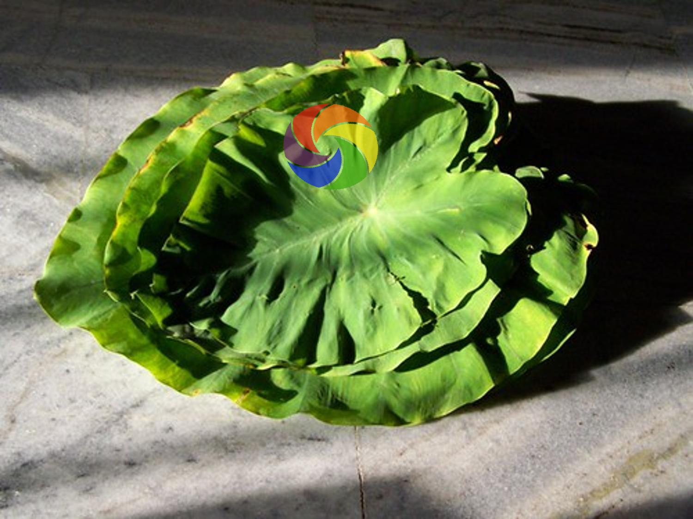

# Object Detection Data Synthesis

Data Synthesis pipeline to generate object detection data

<a href="https://pypi.org/project/mdetsyn/"></a>

## How to run

### Run with pip

``` bash
pip install mdetsyn
```

And run in python file 

``` python
from mdetsyn import run_synthesis, create_args

args = create_args()
run_synthesis(args)
```

### Run with command line

``` bash
python synthesis.py --backgrounds ./backgrounds \
                    --objects ./objects \
                    --savename ./synthesis \
                    --number 1000 \
                    --class_mapping ./class_mapping.json \
                    --class_txt ./classes.txt
```

## Sample

- Backgrounds folder contain background images (in any folmat)

```
├── backgrounds/
    ├── background-0.jpg
    ├── background-1.jpg
    └── ...
```

- Objects folder contain object images in subfolders (the best is `.png` format with `A` channel but any format is still runnable)

```
├── objects/
    ├── class_1/
    │   ├── image-0.png
    │   ├── image-1.png
    │   └── ...
    ├── class_2/
    └── ...
```

- Each image in objects folder will be synthesis by `n` times with `n` is user input

- Output is a synthesis folder contain `images` and `labels` dir same as YOLO format

- Sample visualization:

| Background | Object | Synthesis |
| :---: | :---: | :---: |
|  |  |  |

## Support synthesis methods

- Random Resize
- Random Rotate
- Random Transparency
- Random Perspective Transform
- Seamless Clone
- Grayscale

## Error and TODO

- [ ] Sometimes seamless clone does not work
- [x] Input parameter for each augment
- [ ] Add default arguments to argparse help